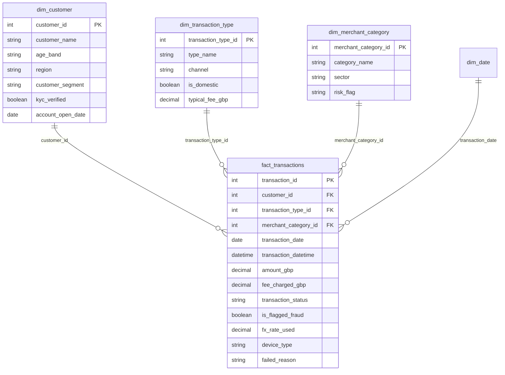

# Zephyr Bank Transaction Analytics

**Power BI dashboard** analyzing transaction health, fraud exposure, and fee revenue for a fictional UK neobank, built for Risk, Finance, Product, and Compliance teams.


## Table of Contents

- [I. Introduction](#i-introduction)
- [II. Design Thinking](#ii-design-thinking)
- [III. Visualization](#iii-visualization)
- [IV. Insight and Recommendation](#iv-insight-and-recommendation)
- [V. Recommendations](#v-recommendations)
- [VI. Limitations and To Validate](#vi-limitations-and-to-validate)
- [Tech Stack](#tech-stack)

## I. Introduction

### 1. Dataset

~1,500 digital transactions from 20 customers of a UK neobank, January to May 2026 (H1 2026 brief). Star schema: one fact table, three dimension tables, plus an Extended Calendar table (`dim_date`) for time analysis.



#### fact_transactions

| Column | Type | Description |
|---|---|---|
| transaction_id | INTEGER | Unique transaction identifier |
| customer_id, transaction_type_id, merchant_category_id | INTEGER | Foreign keys to the dimension tables |
| transaction_date, transaction_datetime | DATE, DATETIME | When the transaction occurred |
| amount_gbp | DECIMAL | Transaction value in GBP |
| fee_charged_gbp | DECIMAL | Fee actually charged (may differ from the typical fee if waived or in error) |
| transaction_status | STRING | Completed, Declined, Pending, Reversed |
| is_flagged_fraud | BOOLEAN | TRUE if the fraud engine flagged the transaction |
| fx_rate_used | DECIMAL | FX rate for international transactions; NULL for domestic |
| device_type | STRING | iOS, Android, Web, N/A |
| failed_reason | STRING | Reason for Declined or Reversed; NULL otherwise |

#### Dimension tables

| Table | Rows | Key columns |
|---|---|---|
| dim_customer | 20 | customer_segment (Starter, Standard, Premium, Business), region, age_band, kyc_verified, account_open_date |
| dim_transaction_type | 15 | type_name, channel (Mobile App, Web Browser, ATM Network, Automated), is_domestic, typical_fee_gbp |
| dim_merchant_category | 18 | category_name, sector, risk_flag (Low, Medium, High) |

### 2. Problem to Be Solved

Build a decision-making dashboard to:

- Monitor transaction health (Total Transaction, Trnsaction Value, Completion, Failed rates)
- Locate fraud exposure by segment, merchant category, customer, and time
- Detect fee billing errors (under-collection and overcharging)
- Check whether declared risk ratings match actual fraud outcomes

**Key questions**

- How have transaction volume and value trended month-on-month?
- Which customer segments drive the highest volumes and values?
- What share of transactions is flagged as fraud, and how does it vary by merchant category?
- Does the declared `risk_flag` align with actual fraud events?
- Are fees applied consistently, or is there leakage and overcharging?
- Which channels, devices, and transaction types fail most?
- Which individual customers generate outsized risk?

## II. Design Thinking

### Step 1: Empathize

Four stakeholder groups: **Risk** (where is fraud concentrated), **Finance** (is fee revenue correct), **Product** (where do transactions fail), **Compliance** (is KYC working).

### Step 2: Define POV

North star metrics

| Area | Metrics |
|---|---|
| Transaction health | Total Transaction, Transaction Value, Completion Rate, Failed Rate (Declined + Reversed) |
| Fraud and risk | Fraud Flag Rate |
| Revenue health | Fee Revenue, Revenue Leakage |

### Step 3: Ideate

Five report pages: Executive Overview (bank pulse), Risk (where fraud sits), Finance (fee revenue and leakage), Product (channels, devices, failures), Customer Investigation (drill-through to one customer).

### Step 4: Prototype and Review

Chart types matched to each question: line charts for trends, bar charts for mutually exclusive categories, matrix heatmaps for two-dimensional combinations (day × time), tables for customer-level investigation. Rates are shown with transaction counts (n) because the sample is small.

## III. Visualization

### Executive Overview

*What does the bank look like?*

- How have transaction count and value trended month-on-month?
- What is the status mix (Completed, Declined, Pending, Reversed)?
- Which channels carry the most transaction value?
- Which UK regions generate the most transaction activity, and where are fraud events concentrated?
- Which segments drive the highest values?
- Do unverified (non-KYC) customers show disproportionate rates of fraud-flagged transactions?


### Risk

*Where does fraud concentrate?*

- What is the Fraud Rate Trend ?
- Fraud Rate across customer_segment ?
- What percentage of all transactions were flagged as fraudulent, and how does this vary by merchant category?
- Fraud Rate through device_type ?
- Is there a day-of-week or time-of-day pattern in high-risk transactions?
- Do fraud-flagged transactions correlate with non-KYC-verified customers?


### Fee Revenue and Leakage 

*Are we collecting the right fees?*

- What is the fee revenue trend ?
- Which transaction types contribute Fee revenue the most ?
- Are there transaction type or merchant categories where actual fees charged deviate from the typical fee - suggesting waivers or errors?
- Which customer segments generate the highest fee revenue per transaction?
- Which transaction type contribute the most ?(Domestic or  International ?)


### Product and Operation

*Where do transactions fail?*

- Which channel fails most?
- Which transaction types fail most?
- Do international transactions fail more than domestic?
- How does device usage differ by segment and Which devices see the most failures?
- Are channel failures Declines or Reversals?


### Customer Investigation

Drill-through page: review one customer's transactions, flags, fees, and status in every dimension.


## IV. Insight and Recommendation

> All rates come from a small sample (~1,500 transactions, 20 customers). Treat them as hypotheses until confirmed with transaction counts.

### 1. Executive Overview

- **Transaction value rose 48.4% versus April, driven by higher activity among Standard clients.**
- **The Automated channel leads with 42.83% of total transaction value.**
- **Premium drives the highest transaction volume and value** (63% of total value).

### 2. Risk

- **London accounts for 60% of all fraud flags** (225 flagged transactions). Investigate this cluster.
- **Premium has the highest fraud rate (40%) and also 63% of value**, so it carries the largest exposure.
- **Merchant categories form two clusters.** Nine categories sit at about 29-31% fraud rate, so Gambling is no worse than Fuel or Electronics.
- **Declared `risk_flag` labels are misaligned with actual fraud outcomes.** High (19.9%), Medium (22.3%), and Low (19.0%) are nearly identical.
- **Half of flagged transactions come from Unknown device.**
- **No strong day or time pattern.** Only Monday morning (38%) and Friday evening (36%) stand out, and small cell sizes make even these tentative.
- **Rajan Mehta generates the most risk.** The nine largest flagged transactions all belong to this one Premium customer and repeat the same amounts. This may be an artefact of the synthetic dataset.
- **KYC:** only 4 customers are currently unverified, so results are not statistically significant. A 0% fraud rate among non-KYC customers does not mean low risk. Compliance must still remediate all 4 non-KYC accounts.

### 3. Finance

- **Fee errors run in both directions and cancel out.** About £587 is under-collected (78% of the £750 expected fees) while a similar amount is overcharged, so net revenue (£750.17 vs £750.00 expected) hides the errors.
- **Transfer - International accounts for the largest fee variance (-£400)** and contributes disproportionately to fee leakage.
- **ATM Withdrawals and Crypto Purchases also deviate from expected fees** (consistently under-collected).
- **Business customers generate the highest fee revenue per transaction (£0.90 - £1.20).**

### 4. Product

- **The failure rate is about 60% across the board, consistent across every channel and failure type.** For a real bank this level would be unacceptable (likely an artefact of the synthetic data).
- **Failure is highest for recurring and automated types** (Card Refund, Loan Repayment, Standing Order at about 75%).

## V. Recommendations

1. **Investigate the London fraud cluster** (60% fraud rate, 225 flagged), starting with Rajan Mehta, the highest-exposure customer.
2. **Recover and correct fee leakage.** Recover £587 in under-collected fees (78% of expected fee revenue), and refund overcharges. Investigate International Transfers first (-£400).
3. **Review fee configuration** for Transfer - International, ATM Withdrawals, and Crypto Purchases, where actual fees consistently deviate from expected fees.
4. **Investigate the root cause of the platform-wide failure rate (about 60%),** starting with Card Refund, Loan Repayment, and Standing Order. Analyse `failed_reason` to determine whether failures stem from insufficient funds, fraud rules, or system processing errors, and review the shared transaction processing flow, since failures are not confined to a single channel.
5. **Re-tier merchant risk ratings** using observed fraud rates, since declared `risk_flag` does not predict actual fraud.
6. **Remediate all 4 non-KYC accounts,** regardless of their 0% observed fraud rate.
7. **Prioritise Business customers for premium products,** as they generate the highest fee revenue per transaction.

## Tech Stack

- Power BI (data model, report pages, drill-through)
- DAX (all measures)
- Star schema with an Extended Calendar table

## Repository Structure

```
.
├── README.md
├── zephyr_bank_dashboard.pbix
├── data/
│   ├── fact_transactions.csv
│   ├── dim_customer.csv
│   ├── dim_transaction_type.csv
│   └── dim_merchant_category.csv
└── images/
    ├── overview.png
    ├── risk.png
    ├── finance.png
    ├── product.png
    └── customer.png
```
