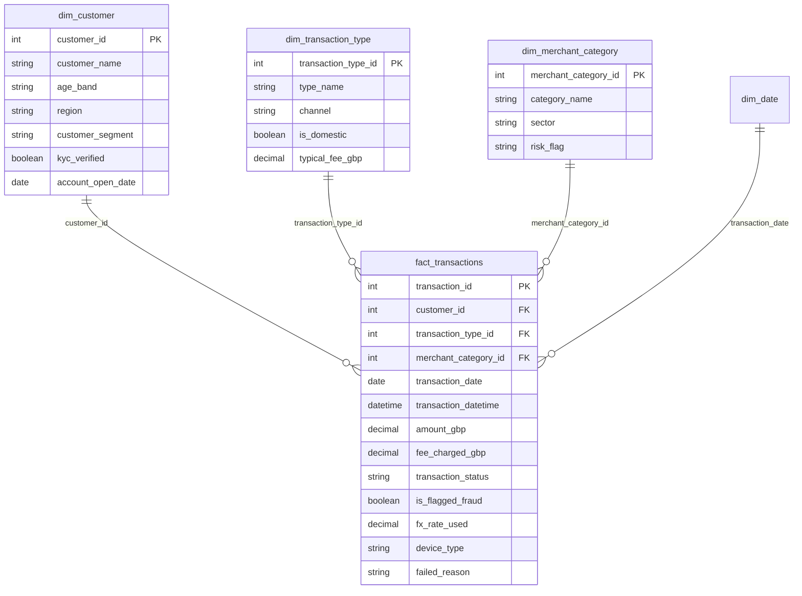

# Zephyr Bank Transaction Analytics

**Power BI dashboard** analyzing transaction health, fraud exposure, and fee revenue for a fictional UK neobank, built for Risk, Finance, Product, and Compliance teams.


## Table of Contents

- [I. Introduction](#i-introduction)
- [II. Design Thinking](#ii-design-thinking)
- [III. Visualization](#iii-visualization)
- [IV. Insight and Recommendation](#iv-insight-and-recommendation)
- [V. Recommendations](#v-recommendations)
- [VI. Limitations and To Validate](#vi-limitations-and-to-validate)
- [Tech Stack](#tech-stack)

## I. Introduction

### 1. Dataset

~1,500 digital transactions from 20 customers of a UK neobank, January to May 2026 (H1 2026 brief). Star schema: one fact table, three dimension tables, plus an Extended Calendar table (`dim_date`) for time analysis.



#### fact_transactions

| Column | Type | Description |
|---|---|---|
| transaction_id | INTEGER | Unique transaction identifier |
| customer_id, transaction_type_id, merchant_category_id | INTEGER | Foreign keys to the dimension tables |
| transaction_date, transaction_datetime | DATE, DATETIME | When the transaction occurred |
| amount_gbp | DECIMAL | Transaction value in GBP |
| fee_charged_gbp | DECIMAL | Fee actually charged (may differ from the typical fee if waived or in error) |
| transaction_status | STRING | Completed, Declined, Pending, Reversed |
| is_flagged_fraud | BOOLEAN | TRUE if the fraud engine flagged the transaction |
| fx_rate_used | DECIMAL | FX rate for international transactions; NULL for domestic |
| device_type | STRING | iOS, Android, Web, N/A |
| failed_reason | STRING | Reason for Declined or Reversed; NULL otherwise |

#### Dimension tables

| Table | Rows | Key columns |
|---|---|---|
| dim_customer | 20 | customer_segment (Starter, Standard, Premium, Business), region, age_band, kyc_verified, account_open_date |
| dim_transaction_type | 15 | type_name, channel (Mobile App, Web Browser, ATM Network, Automated), is_domestic, typical_fee_gbp |
| dim_merchant_category | 18 | category_name, sector, risk_flag (Low, Medium, High) |

### 2. Problem to Be Solved

Build a decision-making dashboard to:

- Monitor transaction health (completion, decline, and reversal rates)
- Locate fraud exposure by segment, merchant category, customer, and time
- Detect fee billing errors (under-collection and overcharging)
- Check whether declared risk ratings match actual fraud outcomes

**Key questions**

- How have transaction volume and value trended month-on-month?
- Which customer segments drive the highest volumes and values?
- What share of transactions is flagged as fraud, and how does it vary by merchant category?
- Does the declared `risk_flag` align with actual fraud events?
- Are fees applied consistently, or is there leakage and overcharging?
- Which channels, devices, and transaction types fail most?
- Which individual customers generate outsized risk?

## II. Design Thinking

### Step 1: Empathize

Four stakeholder groups: **Risk** (where is fraud concentrated), **Finance** (is fee revenue correct), **Product** (where do transactions fail), **Compliance** (is KYC working).

### Step 2: Define POV

North star metrics

| Area | Metrics |
|---|---|
| Transaction health | Completion Rate, Failed Rate (Declined + Reversed) |
| Fraud and risk | Fraud Flag Rate, Risk Exposure |
| Revenue health | Fee Revenue, Revenue Leakage |

### Step 3: Ideate

Five report pages: Executive Overview (bank pulse), Risk (where fraud sits), Finance (fee revenue and leakage), Product (channels, devices, failures), Customer Investigation (drill-through to one customer).

### Step 4: Prototype and Review

Chart types matched to each question: line charts for trends, bar charts for mutually exclusive categories, matrix heatmaps for two-dimensional combinations (day × time), tables for customer-level investigation. Rates are shown with transaction counts (n) because the sample is small.

## III. Visualization

### Executive Overview

*What does the bank look like?*

- How have transaction count and value trended month-on-month?
- What is the status mix (Completed, Declined, Pending, Reversed)?
- Which channels carry the most transaction value?
- Which segments drive the highest values?


### Risk

*Where does fraud concentrate?*

- What share of transactions is flagged, and how does it trend?
- Which segments, merchant categories, and devices show the highest fraud rates?
- Is there a day-of-week or time-of-day pattern?
- Does declared `risk_flag` match actual fraud rates?
- Which transactions carry the highest exposure?


### Finance

*Are we collecting the right fees?*

- What is total fee revenue, and which transaction types contribute most?
- Where are fees under-collected (including waivers) or overcharged?
- Which segments generate the highest fee revenue per transaction?


### Product

*Where do transactions fail?*

- Which channels and transaction types have the highest failure rates?
- Which devices are associated with the most failed transactions?
- Do ATM reversals or international declines point to a systemic issue?


### Customer Investigation

Drill-through page: review one customer's transactions, flags, fees, and status in every dimension.


## IV. Insight and Recommendation

> All rates come from a small sample (~1,500 transactions, 20 customers). Treat them as hypotheses until confirmed with transaction counts.

### 1. Executive Overview

- **Activity is stable month to month.** Monthly count stays between 279 and 322 with no clear trend. Status mix is steady: about 35% Declined, 25% Pending, 25% Reversed, 15% Completed.
- **Value is concentrated.** Premium accounts for 63% of transaction value (£1.20M); Standard, Starter, and Business hold 14%, 13%, and 9%. Automated and Mobile App channels carry about 43% and 36% of value.

### 2. Risk

- **Fraud is steady at about 20%.** 300 of ~1,500 transactions are flagged, with no sustained trend. April dips to about 13%, May rebounds to about 23%.
- **Declared risk ratings do not match actual fraud.** High (19.9%), Medium (22.3%), and Low (19.0%) are nearly identical. Fraud by merchant category splits into two clusters (about 30% and about 11%), so the data supports two tiers, not three.
- **Premium has the highest fraud rate (40%) and the largest exposure.** Flagged exposure is £1.19M, which suggests fraud skews toward large transactions.
- **Risk is concentrated in individual customers.** The nine largest flagged transactions belong to one Premium customer, are all Reversed, and repeat the same amounts (£17,273 six times, £16,818 three times). They total about £154K, roughly 13% of exposure. This pattern may be an artefact of the synthetic dataset.
- **No strong time pattern.** Day and time-of-day fraud rates mostly fall within 12 to 27%. Monday morning (38%) and Friday evening (36%) stand out, but cell sizes are small.

### 3. Finance

- **Fee errors run in both directions and cancel out.** About £587 is under-collected (78% of the £750 expected) while a similar amount is overcharged. Net fee revenue is £750.17 against £750.00 expected, so the total looks correct and hides the errors.

### 4. Product

- **Failure is common.** Declined and Reversed together make up about 60% of transactions (900 of 1,500), far above what a healthy bank would show. This likely reflects how the synthetic data was generated.

## V. Recommendations

1. **Investigate the highest-exposure customer first.** Check whether one customer explains Premium's 63% value share and 40% fraud rate. Split exposure into Completed + flagged (potential loss) and Reversed + flagged (blocked).
2. **Re-tier merchant risk ratings using observed fraud rates.** Check which categories rated Low or Medium sit in the 30% cluster (Fuel is highest at 31%).
3. **Fix fee billing in both directions.** Recover the £587 under-collected and refund the overcharges. Do not recover only the shortfall.

## VI. Limitations and To Validate

- Synthetic data: ~1,500 rows expanded from 20 seed rows, so repeated amounts and uniform rates may be artefacts.
- Reconcile flagged counts across pages (300 overall versus any month-filtered card).
- Confirm segment-level failure rates (for example Business) after removing all filters, with n shown.
- Add a KYC-verified versus non-verified fraud comparison; no page covers it yet.
- Compare the device mix of fraud against the device mix of all transactions.

## Tech Stack

- Power BI (data model, report pages, drill-through)
- DAX (all measures)
- Star schema with an Extended Calendar table

## Repository Structure

```
.
├── README.md
├── zephyr_bank_dashboard.pbix
├── data/
│   ├── fact_transactions.csv
│   ├── dim_customer.csv
│   ├── dim_transaction_type.csv
│   └── dim_merchant_category.csv
└── images/
    ├── overview.png
    ├── risk.png
    ├── finance.png
    ├── product.png
    └── customer.png
```
